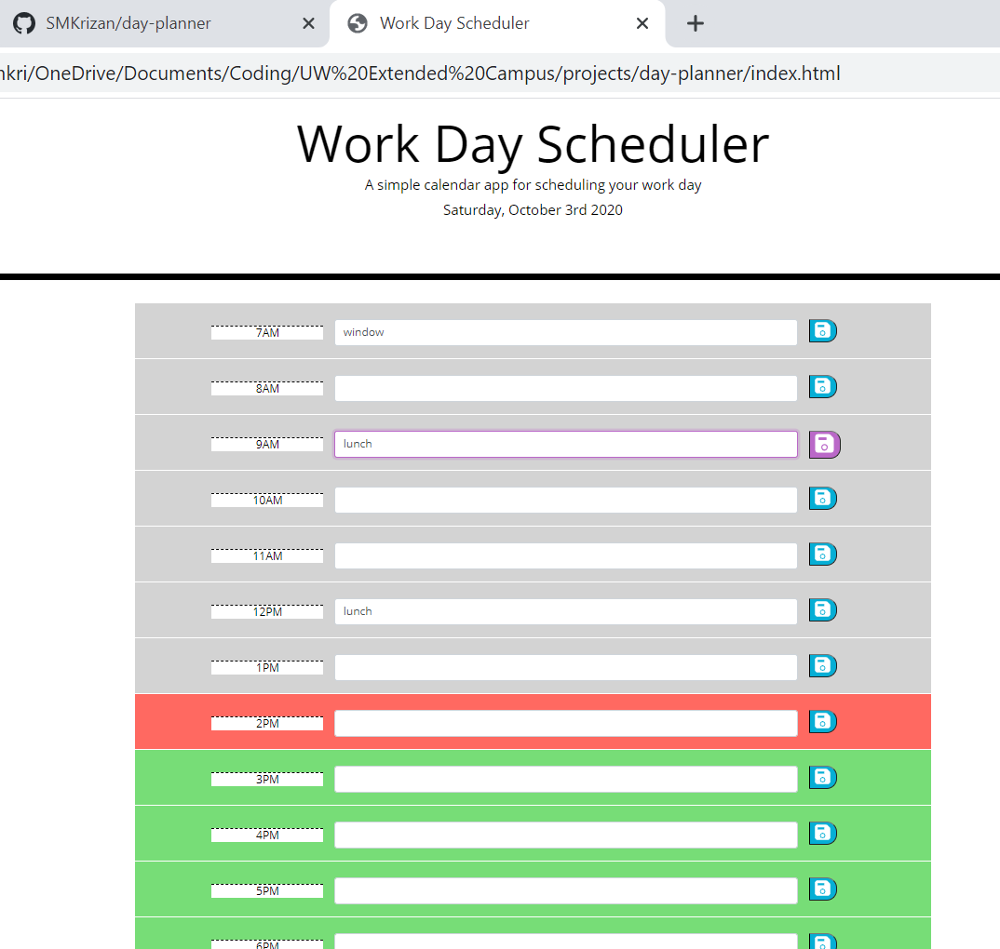

# Day Planner

## PURPOSE
This calendar application runs in the browser and allows users to save events for each hour of the work day.

## Screenshot

## BUILT WITH
* HTML
* CSS
* JQuery

## WEBSITE
https://smkrizan.github.io/day-planner/

### CONTRIBUTION
Made with ☕+❤️ by Sara Krizan and in consultation with several LAs, TA, and learning instructor through the University of Wisconsin Extended Campus Coding Bootcamp.
